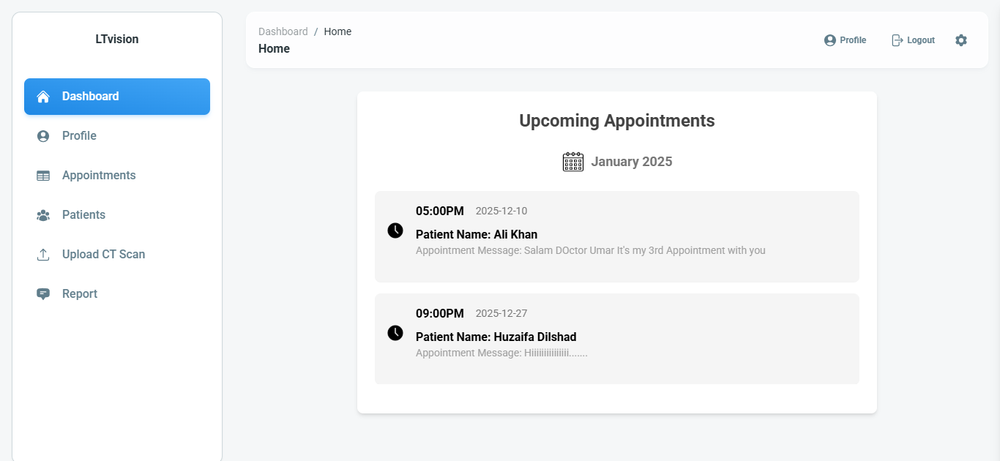
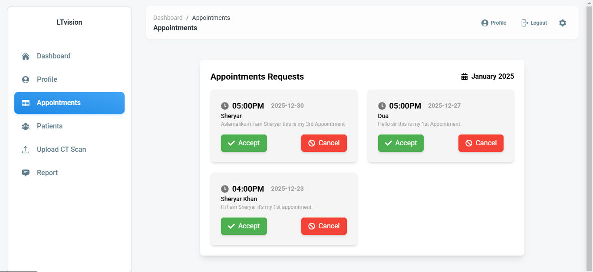
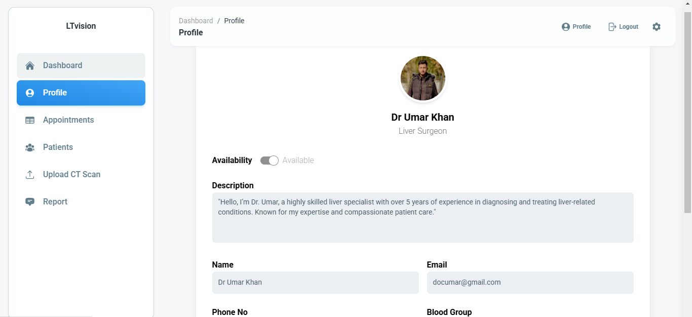
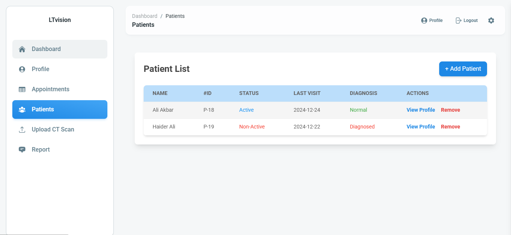
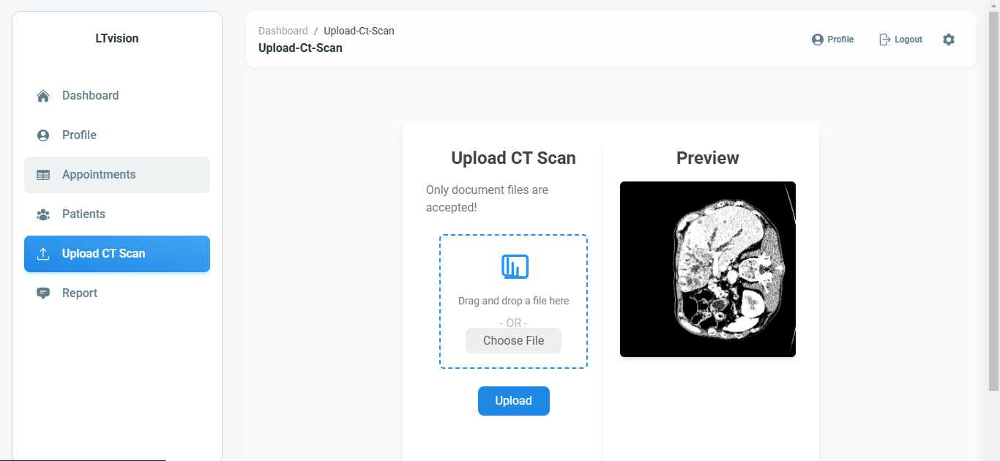
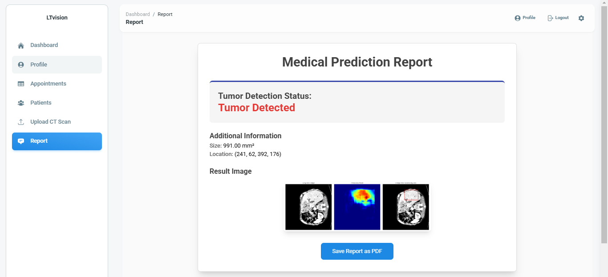

# LtVision Project
Welcome to the LtVision Project Repository! 🚀 This repository highlights my expertise in developing a comprehensive health-tech application integrating AI, web development, and mobile solutions.

## About Me
I am a full-stack developer with expertise in web development, AI integration, and backend systems. I specialize in crafting scalable applications using MERN stack, Flask, and computer vision technologies like OpenCV. My experience spans from building AI-powered tools to implementing robust backend solutions.

## Expertise

### 🌐 Tech Stack
- **Frontend**: React.js
- **Backend**: Node.js, Express.js, Flask
- **Database**: MongoDB
- **Computer Vision**: OpenCV

### 🔧 Tools & Technologies
- Programming Languages: JavaScript, Python
- AI Integration: Flask, OpenCV
- Backend Development: Node.js, Express.js
- Mobile Backend Development: Node.js, MongoDB

## Featured Projects

### 1. AI-Powered Liver Tumor Detection
- **Tools & Technologies**: Flask, OpenCV
- Developed AI models for liver segmentation and tumor detection.
- Integrated the models into a Flask API for real-time analysis.

### 2. Health-Tech Web Application
- **Tools & Technologies**: MERN Stack
- Built a user-friendly web application for secure user authentication, symptom checking, and doctor recommendations.
- Integrated AI-powered diagnostics and reporting.

### 3. Mobile App Backend
- **Tools & Technologies**: Node.js, Express.js, MongoDB
- Developed a robust backend for the mobile version of the health-tech app.
- Ensured seamless integration with AI services and data storage.

## Project Screenshots

### Dashboard

### Appointments

### Doctor Profile

### Patient List

### AI-Powered Liver Tumor Detection
## Upload Section

## Report Section

## Contact Me
- **LinkedIn**: [Muhammad Umar](https://www.linkedin.com/in/mohammad-umar-0a7bb4269/)
- **GitHub**: [Muhammad Umar](https://github.com/mohammadumark)
- **Email**: umarkhurshid09@gmail.com

Feel free to explore the projects in this repository and connect with me for collaboration or inquiries. Happy coding! 😊
